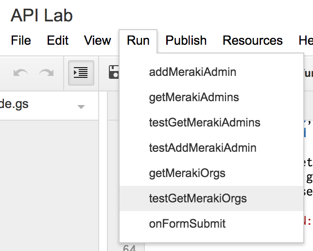

# Meraki Dashboard with Google Scripts & Forms

## Overview

This learning lab demonstrates the power of Meraki APIs with Google Scripts and Forms.

By building a simple Google Form and attaching a script written in JS, a Meraki Dashboard administrator can easily be created. This is incredibly helpful when running workshops that require several administrators to have access to a lab network.

By allowing a workshop attendee to simply fill in a web form, you can collect additional information and register a Meraki account without intervention.

This concept could also be used to leverage the many other API calls available with a Meraki network such as making changes to a WiFi SSID or switch port.

# Instructions
## Create a Google Form.
https://forms.google.com
### The first two questions should be as follows:
- Email
- Name

[SAMPLE]

## Link the form to a Google Script.

## Paste the contents of this repository's **code.gs** file into the Google Scripts IDE.

- update the **API_KEY**, **ORG_ID** and **SHARD** to match your settings.
- save your changes

## Add a Trigger to launch the script when the Form is submitted.

- select the onFormSubmit function

## Test the API calls
Several additional functions are included in this code to allow you to test with sample data and collect information.  
Feel free to modify the sample JSON data defined in the `testAddMerakiAdmin` function.

- Run menu

- select a function, such as **testGetMerakiOrgs**.

## View the results
- View --> Logs menu

## Google Form Test
Once you have confirmed that the script is returning accurate results, test the Google Form. If everything worked, you should get an email from Meraki asking to complete the admin account verification.

