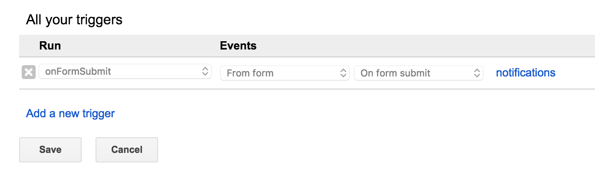

# googleform-registerMerakiAdmin
A Google Script to create a Meraki Dashboard admin account based on their Google Form entry.

# Instructions
##Create a Google Form.

##The first two questions should be as follows:
- Email
- Name

(SAMPLE, create this yourself.)

##Link the form to a Google Script. 

##Paste the contents of this repository's 'code.gs' into the Google Scripts IDE.

##Add a Trigger to launch the script when the Form is submitted.

- select the onFormSubmit function

##Test the API calls
- Run menu

- select a function, such as **testGetMerakiOrgs. 

##View the results
- View --> Logs menu

